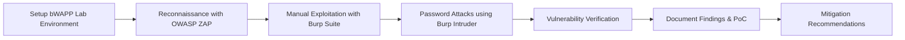

# 🐝 bWAPP Web Application Penetration Testing

## 📌 Internship Project – Future Interns
This project was completed as part of my internship program with **Future Interns**, focusing on **Web Application Penetration Testing**.  
The testing was performed on **bWAPP**, a vulnerable web application, to identify and exploit vulnerabilities in alignment with the **OWASP Top 10**.

---

## 🎯 Objective
-  Conduct Vulnerability scan
-  Create Security Report
- Gain practical experience in identifying, exploiting, and mitigating web application vulnerabilities.
- Apply penetration testing methodologies in a **safe, controlled lab environment**.
- Demonstrate the use of professional security testing tools.

---

## 🔍 Target Application
- **Application:** bWAPP (Bee-box)
- **Platform:** Linux (Bee-box VM) and Website.
- **Purpose:** Security training and penetration testing practice

---

## 🛠 Tools Used
| Tool | Purpose |
|------|---------|
| **bWAPP** | Vulnerable target application |
| **Burp Suite** | Manual exploitation, password brute-force (Intruder) |
| **OWASP ZAP** | Vulnerability scanning and spidering |
| **Kali Linux Utilities** | Supporting reconnaissance and exploitation |
| **FTP / SSH Clients** | Testing service misconfigurations |

---

## 📂 Scope of Testing
The following vulnerabilities from **OWASP Top 10 (2021)** were identified and successfully exploited:

### **A01:2021 – Broken Access Control**
- **IDOR** – Accessed other users' data by modifying request parameters.
- **Directory Traversal** – Retrieved sensitive files via `../../etc/passwd`.

### **A03:2021 – Injection**
- **SQL Injection** – Extracted database records with `' OR '1'='1 --`.
- **Cross-Site Scripting (XSS)** – Injected ``.
- **Command Injection** – Executed system commands on the server.
- **PHP Code Injection** – Injected PHP payloads leading to remote code execution.

### **A07:2021 – Identification and Authentication Failures**
- **Weak Passwords** – Default and weak credentials identified.
- **Password Attacks** – Brute-force using Burp Suite Intruder.

### **A05:2021 – Security Misconfiguration**
- **Exposed FTP Service** – Anonymous login enabled.
- **Open SSH Service** – Weak credentials permitted access.

---

## 📊 Vulnerability Summary Table

| OWASP ID | Vulnerability | Impact | Severity | Tool(s) Used |
|----------|--------------|--------|----------|--------------|
| A01 | IDOR | Unauthorized data access | High | Burp Suite |
| A01 | Directory Traversal | Disclosure of system files | High | Burp Suite |
| A03 | SQL Injection | Database compromise | Critical | OWASP ZAP, Burp Suite |
| A03 | XSS (Stored/Reflected) | Session hijacking, data theft | High | OWASP ZAP |
| A03 | Command Injection | Remote command execution | Critical | Burp Suite |
| A03 | PHP Code Injection | Full server compromise | Critical | Manual exploitation |
| A05 | Exposed FTP Service | Unauthorized file retrieval | Medium | FTP Client |
| A05 | Open SSH with Weak Creds | Unauthorized server access | High | SSH Client |
| A07 | Weak Passwords | Unauthorized account access | High | Burp Suite |
| A07 | Password Brute-Force | Account takeover | High | Burp Suite |

---

## 📊 Pentesting Workflow

---

## 🛡 Mitigation Recommendations

| Vulnerability | Recommended Fix |
|---------------|-----------------|
| **IDOR** | Implement strict server-side access control and authorization checks. |
| **Directory Traversal** | Sanitize inputs and enforce a file access allowlist. |
| **SQL Injection** | Use parameterized queries and ORM frameworks. |
| **XSS** | Encode output, sanitize inputs, and implement Content Security Policy (CSP). |
| **Command/PHP Injection** | Validate inputs, restrict OS command calls, and disable risky PHP functions. |
| **Weak Passwords** | Enforce strong password policies and multi-factor authentication (MFA). |
| **Password Attacks** | Use rate limiting, account lockout, and CAPTCHA. |
| **Security Misconfigurations** | Disable unused services, secure SSH/FTP, and restrict firewall rules. |

---

## 📚 References
- [OWASP Top 10 – 2021](https://owasp.org/Top10/)
- [bWAPP Official Page](http://www.itsecgames.com/)
- [Burp Suite Documentation](https://portswigger.net/burp/documentation)
- [OWASP ZAP Documentation](https://www.zaproxy.org/docs/)
  

