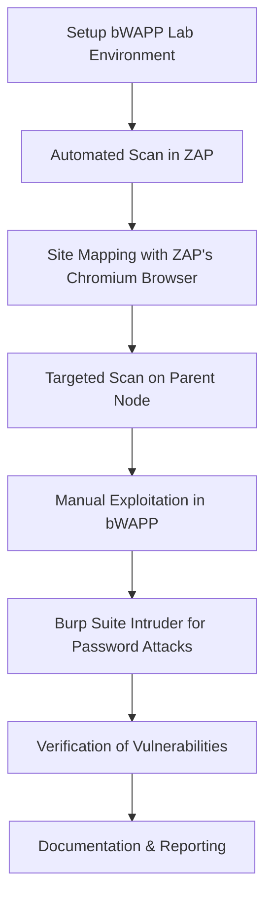

# 🐝 bWAPP Web Application Penetration Testing

## 📌 Internship Project – Future Interns
This project was completed as part of my internship program with **Future Interns**, focusing on **Web Application Penetration Testing**.  
The testing was performed on **bWAPP**, a deliberately vulnerable web application, to identify and exploit vulnerabilities in alignment with the **OWASP Top 10**.

---

## 🎯 Objective
- Conduct vulnerability scans and exploitation in a safe lab.
- Create a structured **security report** for identified vulnerabilities.
- Gain practical experience in **web application penetration testing**.
- Apply **OWASP Top 10** methodologies for real-world scenarios.
- Demonstrate the use of professional security testing tools.

---

## 🔍 Target Application
- **Application:** bWAPP (Bee-box)
- **Platform:** Linux (Bee-box VM) & Web Interface
- **Purpose:** Security training and hands-on penetration testing practice

---

## 🛠 Tools Used
| Tool | Purpose |
|------|---------|
| **bWAPP** | Vulnerable target application |
| **Burp Suite** | Password brute-force (Intruder), manual testing |
| **OWASP ZAP** | Automated scanning, site mapping, manual vulnerability scanning |
| **Kali Linux Utilities** | Reconnaissance and exploitation |
| **FTP / SSH Clients** | Service misconfiguration testing |

---

## 📂 Scope of Testing
The following vulnerabilities from **OWASP Top 10 (2021)** were identified and successfully exploited:

### **A01:2021 – Broken Access Control**
- **IDOR** – Accessed other users' data by modifying request parameters.
- **Directory Traversal** – Retrieved sensitive files (`/etc/passwd`).

### **A03:2021 – Injection**
- **SQL Injection** – Accessed `users` table and retrieved password hashes using payload `' OR '1'='1 --`.
- **Cross-Site Scripting (XSS)** – Injected `` into input fields.
- **Command Injection** – Executed system commands remotely.
- **PHP Code Injection** – Achieved remote code execution via malicious PHP payloads.

### **A07:2021 – Identification & Authentication Failures**
- **Weak Passwords** – Default/weak credentials found.
- **Password Attacks** – Successful brute-force attack using Burp Suite Intruder.

### **A05:2021 – Security Misconfiguration**
- **Exposed FTP Service** – Anonymous login allowed.
- **Open SSH Service** – Weak credentials permitted access.

---

## 📊 Vulnerability Summary Table

| OWASP ID | Vulnerability | Impact | Severity | Tool(s) Used |
|----------|--------------|--------|----------|--------------|
| A01 | IDOR | Unauthorized data access | High | Manual, ZAP |
| A01 | Directory Traversal | Disclosure of system files | High | ZAP |
| A03 | SQL Injection | Database compromise | Critical | ZAP, Burp Suite |
| A03 | XSS (Stored/Reflected) | Session hijacking | High | ZAP |
| A03 | Command Injection | Remote command execution | Critical | ZAP |
| A03 | PHP Code Injection | Full server compromise | Critical | Manual |
| A05 | Exposed FTP Service | Unauthorized file retrieval | Medium | FTP Client |
| A05 | Open SSH Weak Creds | Unauthorized server access | High | SSH Client |
| A07 | Weak Passwords | Account takeover | High | Manual |
| A07 | Password Brute-Force | Account takeover | High | Burp Suite |

---

## 🔎 Pentesting Process

### **1. Lab Setup**
- Imported **Bee-box VM** into VirtualBox.
- Configured host-only networking to allow access from Kali Linux attacker machine.

### **2. Initial Reconnaissance**
- Verified application availability at `http://localhost/bWAPP`.
- Identified bWAPP’s various vulnerability modules.

### **3. Vulnerability Scanning (OWASP ZAP)**
1. Performed an **automated scan** to get initial results.
2. Used **ZAP's Chromium-based browser** to manually browse bWAPP features and generate the **site map**.
3. Selected the **parent node** `http://localhost/bWAPP` in ZAP's Sites Tree.
4. Initiated a **targeted vulnerability scan** on the parent node to detect OWASP Top 10 issues.

### **4. Exploitation**
- **SQL Injection**: Retrieved `users` table and extracted stored password hashes.
- **XSS**: Injected JavaScript payloads in vulnerable forms.
- **Command Injection**: Executed `ls`, `cat`, and other OS commands.
- **PHP Injection**: Uploaded/Injected PHP payloads for full RCE.
- **Directory Traversal**: Accessed `/etc/passwd` by manipulating file path parameters.
- **IDOR**: Accessed other user accounts by changing numeric IDs in requests.
- **Burp Suite Intruder**: Performed password brute-force against login form.

### **5. Verification**
- Cross-checked ZAP scan results with manual testing.
- Re-ran vulnerable modules to confirm exploit reproducibility.

### **6. Documentation**
- Recorded each finding with **PoC screenshots** and payloads.
- Mapped vulnerabilities to **OWASP Top 10** categories.

---

## 📊 Pentesting Workflow (Diagram)

---

## 📸 Proof of Concept (PoC)
Screenshots are available in the **/screenshots** folder. All tests were conducted in an isolated lab.

1. **IDOR Exploitation** – Accessed unauthorized user records.
2. **SQL Injection Output** – Retrieved database dump.
3. **XSS Alert** – JavaScript payload execution pop-up.
4. **Command Injection** – Successful OS command execution.
5. **FTP Access** – Anonymous login to sensitive files.

---

## 🛡 Mitigation Recommendations

| Vulnerability               | Recommended Fix |
|-----------------------------|-----------------|
| **IDOR**                    | Enforce server-side authorization checks. |
| **Directory Traversal**     | Sanitize inputs; allowlist file access. |
| **SQL Injection**           | Use prepared statements and ORM frameworks. |
| **XSS**                     | Input sanitization, output encoding, and CSP. |
| **Command/PHP Injection**   | Input validation, disable dangerous functions. |
| **Weak Passwords**          | Strong password policy + MFA. |
| **Password Attacks**        | Implement account lockout and rate limiting. |
| **Security Misconfigurations** | Disable unused services; secure FTP/SSH configs. |

---

## 📚 References
- [OWASP Top 10 – 2021](https://owasp.org/Top10/)  
- [bWAPP Official Page](http://www.itsecgames.com/)  
- [Burp Suite Documentation](https://portswigger.net/burp/documentation)  
- [OWASP ZAP Documentation](https://www.zaproxy.org/docs/) 
