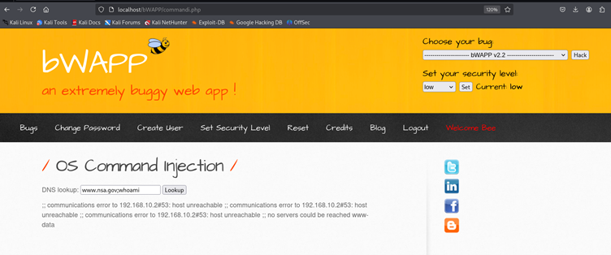
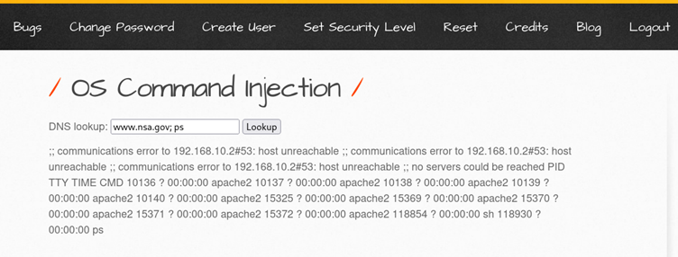
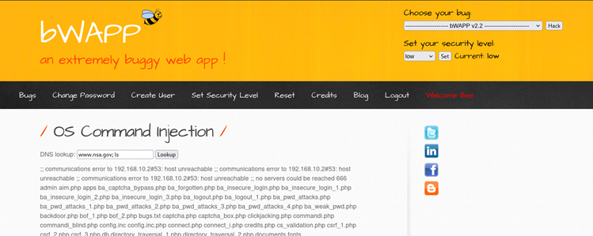
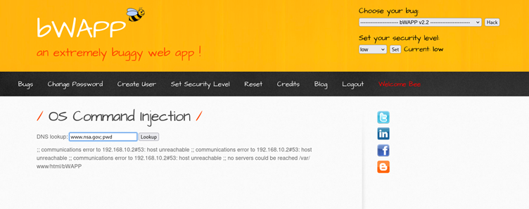
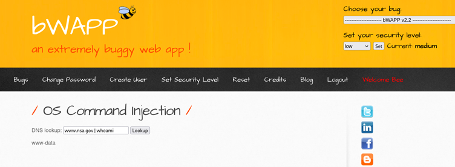

# OS Command Injection

## 1. Description
OS Command Injection is a vulnerability that allows an attacker to execute arbitrary operating system commands on the server hosting the application. It occurs when user input is concatenated directly into a system command without proper validation or sanitization. This gives the attacker the ability to run additional commands with the same privileges as the running application, potentially leading to full system compromise.

**Severity:** Critical  
**CVSS:** **9.8** 

---

## 2. Impact
- **Remote Code Execution (RCE)** – Full control over the target server.
- **Data Theft** – Reading sensitive files (e.g., `/etc/passwd`, config files).
- **System Compromise** – Creating or modifying system files, adding backdoors.
- **Pivoting** – Using the compromised server to attack internal network systems.
- **Denial of Service** – Executing commands to disrupt services.

---

## 3. Attack Vector
The vulnerability lies in the application’s **DNS lookup** functionality, where the user input is directly passed to a system command without sanitization. Example vulnerable parameter:
dns_lookup=<user input>
If an attacker injects special shell characters like `;` or `&&`, they can chain additional OS commands.

---

## 4. Vulnerability Scan
- **Manual Testing** – Entered normal DNS entries (e.g., `www.nsa.gov`) and verified expected results.
- Injected payloads like:
  - `www.nsa.gov; whoami`
  - `www.nsa.gov; ps`
  - `www.nsa.gov; ls`
- Observed command execution results directly in the application response.

---

## 5. How the Attack is Performed

### Case 1 – Executing `whoami` Command
- **Normal Input:** `www.nsa.gov` → Performs DNS lookup.
- **Malicious Input:** `www.nsa.gov; whoami`
- **Result:** Server returns the username under which the web application is running.

---

### Case 2 – Listing Running Processes
- **Malicious Input:** `www.nsa.gov; ps`
- **Result:** Returns a list of running processes on the server, revealing environment details.

---

### Case 3 – Listing Web Application Directory
- **Malicious Input:** `www.nsa.gov; ls`
- **Result:** Displays all files and directories inside the web application folder.

---

### Case 4 – Getting Current Directory Path
- **Malicious Input:** `www.nsa.gov; pwd`
- **Result:** Reveals the absolute path of the web application’s root directory.

---

### Case 5 – Changing Security Level and Re-testing
- **Security Level:** Medium
- **Payload:** `www.nsa.gov/ whoami`
- **Result:** Confirms that the vulnerability exists even at higher security settings.

---

## 6. Prevention and Mitigation

| Method | Description |
|--------|-------------|
| **Input Validation & Sanitization** | Accept only valid DNS names via regex; block special shell characters (`;`, `&`, `|`, `>`, `<`). |
| **Parameterization** | Use safe APIs or libraries to perform DNS lookups without invoking the OS shell. |
| **Least Privilege** | Run the web server under a restricted user account to minimize impact. |
| **Output Encoding** | Prevent execution of injected commands by encoding user input before processing. |
| **Security Testing** | Regularly test for command injection vulnerabilities using manual testing and automated scanners. |

---
